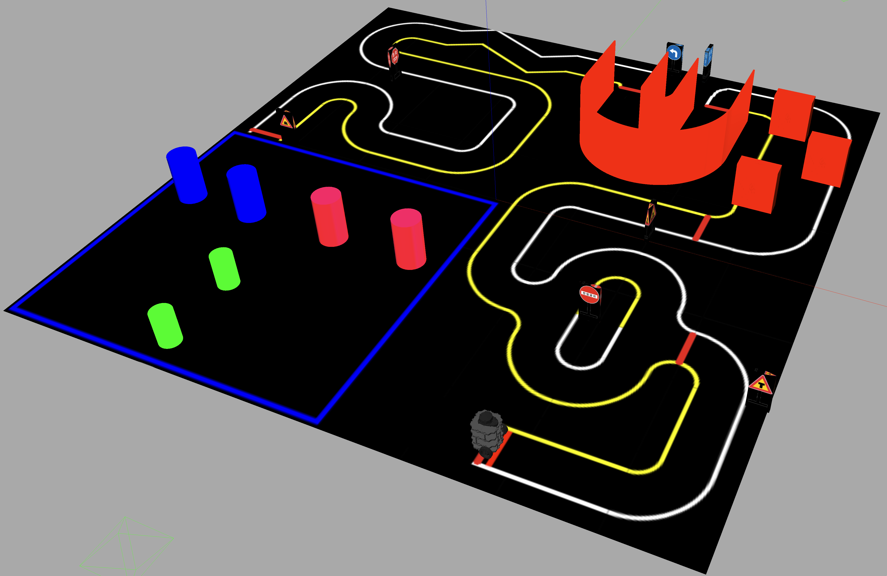
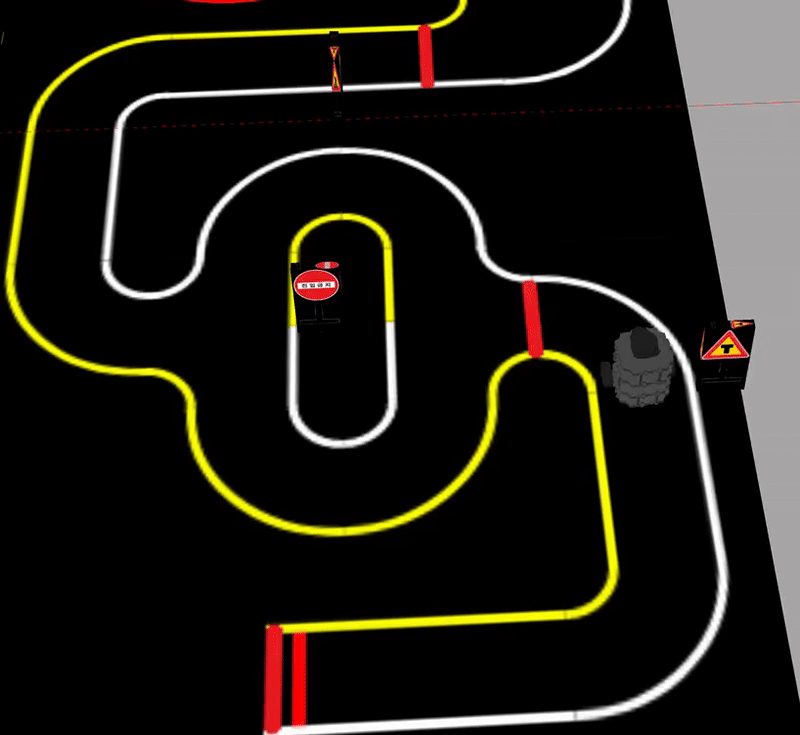
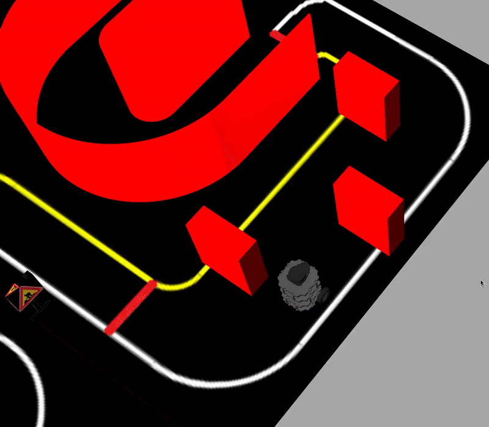
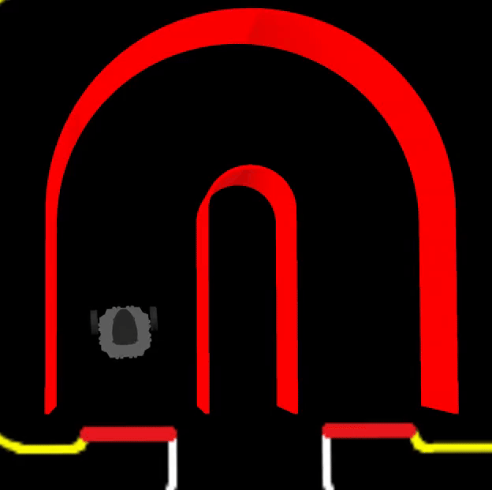
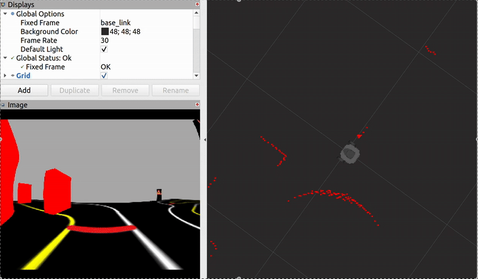

# TurtleBot Autonomous Navigation (ROS 1 Noetic)


This repository contains the code for **TurtleBot3 Burger** solving three autonomous-navigation micro‑challenges inside the Gazebo world below.

The ROS 1 package lets a TurtleBot3 Burger navigate a miniature “driving-school” world in Gazebo (and on the real robot). The map combines coloured lane markings, tunnels and obstacles. The goal was to write a perception + control node for the robot to pass through them.


<p align="center">
  
</p>

| Challenge | Sensor | Gazebo demo | Real‑robot demo |
|-----------|--------|-------------|-----------------|
| Line following | RGB camera |  |  |
| Obstacle avoidance | 360 ° LiDAR |  | no video :(|
| Tunnel navigation | 360 ° LiDAR |  |  |

<p align="center">
  
  <br><em>RViz – left: camera feed used for line detection; right: filtered laser scan.</em>
</p>

> **Gate‑colour navigation (the fourth challenge, where the robot has to pass through the gates based on their colours)** was started but not finished due to time constraints.

---

## Quick‑start with Docker 

```bash
# pull the disposable ROS Noetic container (X11 & Gazebo ready)
docker pull leaveyou/ros1-noetic:latest

# run it, mounting your catkin_ws if you like
docker run -it --rm --name turtlebot_nav --net=host -e DISPLAY=$DISPLAY -v /tmp/.X11-unix:/tmp/.X11-unix leaveyou/ros1-noetic:latest
```

Inside the container:

```bash
# launch challenges
roslaunch projet challenge.launch
# or tele‑operate the robot
roslaunch projet mybot_teleop.launch
```

*No host‑side ROS or Gazebo needed — everything runs in the container.*

---

## Manual installation (bare‑metal ROS)

1. Install **ROS Noetic desktop‑full**, TurtleBot3 packages, scipy and click.  
2. Clone this repo **inside `~/catkin_ws/src` and rename the folder to `projet`**:

   ```bash
   cd ~/catkin_ws/src
   git clone https://github.com/leaveyoustun/autonomous-turtlebot.git projet
   ```

3. **Expose the custom Gazebo models** (add once to your `~/.bashrc`):

   ```bash
   echo 'export GAZEBO_MODEL_PATH=$GAZEBO_MODEL_PATH:~/catkin_ws/src/projet/worlds/model' >> ~/.bashrc
   source ~/.bashrc
   ```

4. Build & launch:

   ```bash
   cd ~/catkin_ws && catkin_make
   source devel/setup.bash

   roslaunch projet challenge.launch 
   ```

---

## Tele‑operation

The repo ships with a simple keyboard **teleop** node:

```bash
roslaunch projet mybot_teleop.launch
```

Keys:

| Key | Action |
|-----|--------|
| `↑ / ↓` | forward / backward |
| `← / →` | rotate left / right |
| `S` | emergency stop |


## Authors

* **Liviu‑Mihai STAN**  
* **Guillaume OUDET** 


